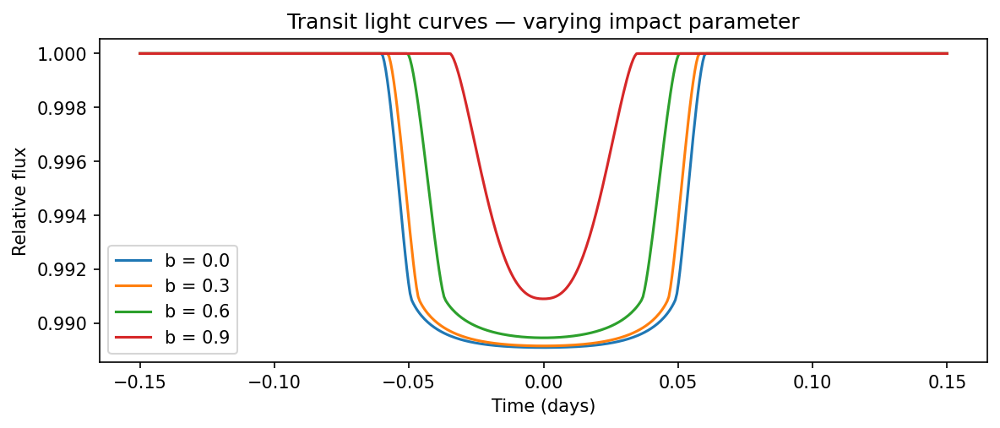
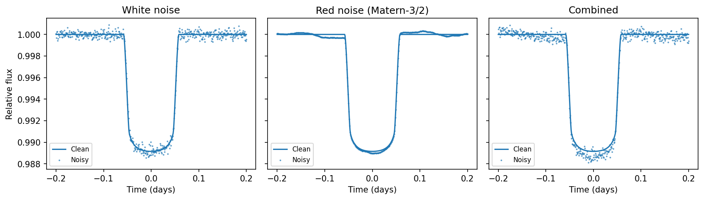
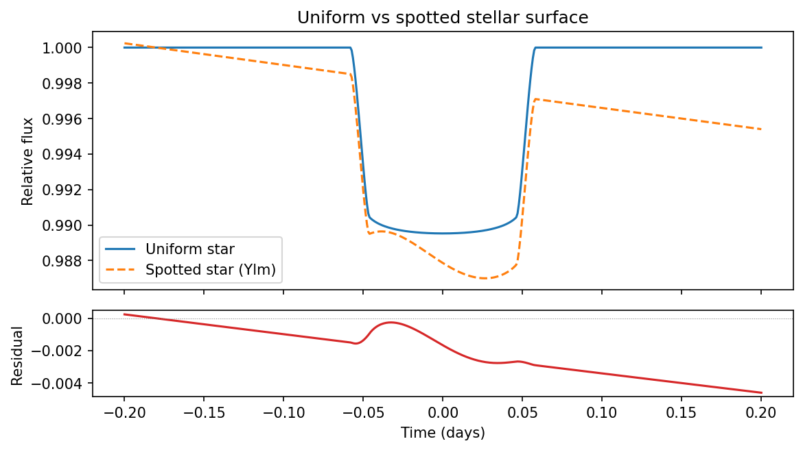

lightcurve-strategies
=====================

.. image:: https://github.com/mit-kavli-institute/lightcurve-strategies/actions/workflows/ci.yml/badge.svg
   :target: https://github.com/mit-kavli-institute/lightcurve-strategies/actions/workflows/ci.yml
   :alt: CI

.. image:: https://img.shields.io/badge/docs-GitHub%20Pages-blue
   :target: https://mit-kavli-institute.github.io/lightcurve-strategies/
   :alt: Documentation

Need realistic exoplanet transit data for your test suite?
**lightcurve-strategies** gives you `Hypothesis <https://hypothesis.readthedocs.io/>`_
strategies that generate physically valid
`jaxoplanet <https://github.com/exoplanet-dev/jaxoplanet>`_ systems and
light curves — complete with limb darkening, stellar surface maps, and
configurable noise — so you can property-test your analysis pipeline
against thousands of random-but-plausible scenarios instead of a handful
of hand-picked fixtures.

What you get
------------

**Orbital & stellar strategies** — generate ``TransitOrbit``,
``Central``/``Body`` Keplerian systems, ``Surface`` objects with
spherical-harmonic maps, and fully assembled ``SurfaceSystem`` instances
with a single function call.

**End-to-end light curves** — the ``light_curves()`` strategy wires up
system generation, flux computation, and noise injection in one step,
returning clean flux, noisy flux, and the noise realisation together.

**Pluggable noise models** — white (Gaussian), red (GP-correlated via
squared-exponential or Matern-3/2 kernels), or any combination.
Seeds are Hypothesis-controlled for reproducibility and shrinkability.

Transit light curves
^^^^^^^^^^^^^^^^^^^^

Generate transits across a range of orbital parameters.  Each call to
your test draws a fresh, physically consistent system:

Realistic noise injection
^^^^^^^^^^^^^^^^^^^^^^^^^

Layer white photon noise, correlated stellar/instrumental noise, or
both on top of the clean transit signal:

Non-uniform stellar surfaces
^^^^^^^^^^^^^^^^^^^^^^^^^^^^^

Test how starspots and surface inhomogeneities affect transit depth and
shape using spherical-harmonic maps:

Quick start
-----------

.. code-block:: bash

   pip install lightcurve-strategies

.. code-block:: python

   import numpy as np
   from hypothesis import given, settings, strategies as st
   from lightcurve_strategies import (
       centrals, bodies, surfaces, surface_systems,
       light_curves, white_noise,
   )

   time = np.linspace(-0.2, 0.2, 500)

   system_strategy = surface_systems(
       central=centrals(mass=st.just(1.0), radius=st.just(1.0)),
       central_surface=surfaces(u=st.just((0.1, 0.3))),
       body=st.tuples(
           bodies(period=st.just(3.0), radius=st.just(0.1)),
           surfaces(),
       ),
       min_bodies=1,
       max_bodies=1,
   )

   @given(
       data=light_curves(
           time=time,
           system=system_strategy,
           noise=st.just(white_noise(scale=5e-4)),
       )
   )
   @settings(max_examples=50)
   def test_transit_dips_below_baseline(data):
       """The stellar flux must never exceed the out-of-transit level."""
       baseline = data.flux[0]
       assert np.all(data.flux <= baseline + 1e-6)

Available strategies
--------------------

.. list-table::
   :header-rows: 1
   :widths: 30 70

   * - Strategy
     - Generates
   * - ``transit_orbits()``
     - ``jaxoplanet.orbits.TransitOrbit``
   * - ``centrals()``
     - ``jaxoplanet.orbits.keplerian.Central``
   * - ``bodies()``
     - ``jaxoplanet.orbits.keplerian.Body``
   * - ``systems()``
     - ``jaxoplanet.orbits.keplerian.System``
   * - ``surfaces()``
     - ``jaxoplanet.starry.surface.Surface`` (with optional Ylm maps)
   * - ``surface_systems()``
     - ``jaxoplanet.starry.orbit.SurfaceSystem``
   * - ``light_curves()``
     - ``LightCurveData`` (flux + noise + system)

Noise helpers: ``white_noise()``, ``red_noise()``, ``combined_noise()``,
``sq_exp_kernel()``, ``matern32_kernel()``.

Documentation
-------------

Full API reference, worked examples, and interactive plots:
https://mit-kavli-institute.github.io/lightcurve-strategies/

Requirements
------------

- Python >= 3.11
- `jaxoplanet <https://github.com/exoplanet-dev/jaxoplanet>`_
- `Hypothesis <https://hypothesis.readthedocs.io/>`_
- `Astropy <https://www.astropy.org/>`_

License
-------

MIT
